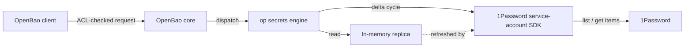

# openbao-plugin-secrets-onepassword

[](https://github.com/NavistAu/openbao-plugin-secrets-onepassword/actions/workflows/ci.yml)
[](https://opensource.org/licenses/MPL-2.0)

`op` is an [OpenBao](https://openbao.org/) secrets engine that serves
[1Password](https://1password.com/) items live, through 1Password's
service-account Go SDK. It holds no durable copy of item data: values
are cached in an in-memory replica, refreshed on a delta cycle, and
refetched from 1Password whenever a plugin process restarts.

## Why this exists

1Password already secures the secret data. What it does not give you
is OpenBao's audit log, ACL model, and dynamic-secret ecosystem sitting
in front of that data. This engine puts a live 1Password vault behind
an OpenBao mount: every read is ACL-gated and audit-logged by OpenBao,
without OpenBao ever taking custody of the underlying secret. Nothing
written to `bao`'s storage backend needs to be trusted with 1Password
item contents, because nothing is written there — the replica lives in
process memory only and is rebuilt from 1Password on every cold start.

That second-order benefit is the point: teams that already manage
access through OpenBao policy get the same governance over
1Password-origin secrets, without copying the data out of 1Password
and without granting 1Password credentials directly to every
consumer.

## Terms

| Term | Meaning here |
| --- | --- |
| item | A 1Password item: a credential, note, or other record with fields, optional sections, and tags. |
| vault (1Password) | A 1Password container for items. Distinct from an OpenBao mount. |
| mount (OpenBao) | The OpenBao path where this engine is enabled (for example `op/`). Distinct from a 1Password vault. |
| replica | This engine's in-memory copy of one allowlisted vault's items. Rebuilt from 1Password on every cold start; never persisted to OpenBao storage. |
| field | A single named value inside an item, such as a password or username. |

## How it works



Every read (`item/…`, `field/…`, `vaults/…`) is served from the
replica. If the replica's data for that vault is outside its freshness
window, the engine first runs a delta cycle: it lists changed items
since the last cycle and fetches only those, then serves the read from
the updated replica. A background loop (`PeriodicFunc`) also runs this
delta cycle on a fixed interval per vault, independent of reads, so
the replica stays warm even without traffic.

## When to use this

Use this engine when consumers already authenticate to OpenBao and you
want OpenBao ACLs and audit logging over secrets that live in
1Password, without copying those secrets into OpenBao's storage
backend or handing out 1Password credentials directly.

Do not use this engine as a general 1Password client, as a way to
migrate secrets permanently into OpenBao (it never stores item data
durably), or where sub-second freshness on every single read is
required regardless of request budget — the replica model trades some
staleness for a bounded, predictable 1Password API request rate.

## Requirements

- An OpenBao server. Built and tested against `openbao/sdk/v2` v2.6.2
  and `openbao/api/v2` v2.6.0.
- A 1Password service-account token with read access to the vaults
  you allowlist.
- Go 1.25 to build from source.

## Installation

### From a release tarball

1. Download the tarball and its checksum file for your platform from
   the [Releases](https://github.com/NavistAu/openbao-plugin-secrets-onepassword/releases)
   page. Releases publish `linux_amd64` and `linux_arm64` builds only.
2. Verify the checksum before use:
   ```sh
   sha256sum -c openbao-plugin-secrets-onepassword_<version>_linux_amd64.tar.gz.sha256
   ```
3. Extract the tarball and copy the `openbao-plugin-secrets-onepassword`
   binary into your OpenBao plugin directory.

A release tarball needs no Go toolchain on the target host, but it
only covers linux/amd64 and linux/arm64. Other platforms must build
from source.

### From source

```sh
go build -o openbao-plugin-secrets-onepassword ./cmd/openbao-plugin-secrets-onepassword
```

Building from source works on any platform Go supports, but requires
a Go 1.25 toolchain on the build host and does not benefit from a
release's pre-computed checksum — compute your own with `sha256sum`.

### Register and mount

```sh
SHA256=$(sha256sum openbao-plugin-secrets-onepassword | awk '{print $1}')
bao plugin register -sha256="$SHA256" \
  -command=openbao-plugin-secrets-onepassword secret op
bao secrets enable -path=op op
```

Write the configuration with the service-account token piped through
stdin, never through an argument, so the token never appears in a
process listing:

```sh
printf '%s' "$OP_SERVICE_ACCOUNT_TOKEN" | bao write op/config \
  service_account_token=- vaults=Infra refresh_interval=15m
```

## Configuration reference

All fields are written to `op/config`. `service_account_token` is
required on every write; every other field defaults if omitted. A
write always replaces the whole configuration.

| Field | Type | Default | Effect |
| --- | --- | --- | --- |
| `service_account_token` | string | none, required | 1Password service-account token. Concealed on read. Rewriting it rotates the engine's 1Password client. |
| `vaults` | comma-separated strings | none | Allowlisted 1Password vault names or IDs this engine serves. |
| `refresh_interval` | duration | `15m` | Interval between delta cycles per vault. |
| `daily_request_limit` | integer | `1000` | Configured account-wide daily 1Password API request limit, used for the usage-ceiling calculation. |
| `hourly_read_limit` | integer | `1000` | Configured per-token hourly read limit, used for the usage-ceiling calculation. |
| `passthrough` | boolean | `true` | Serve reads within the freshness window without waiting for the periodic cycle. |
| `passthrough_ceiling_pct` | integer | `25` | Usage ceiling, as a percent of configured limits, above which passthrough fresh-fetches stop. |
| `passthrough_ttl` | duration | `1m` | Per-vault freshness window. `0` means every read triggers a delta cycle. |
| `serve_stale` | boolean | `true` | Serve stale replica data during a 1Password outage instead of failing the read. |
| `negative_cache_ttl` | duration | `30s` | How long the engine caches an unknown miss before retrying. |
| `path_split` | string | empty | Optional delimiter or regex that splits item titles into path segments. Empty means flat titles. |
| `always_fresh` | comma-separated strings | none | `vault/title` entries that bypass the freshness window on every read. |
| `ratelimit_probe_cmd` | string | empty | Optional absolute path to a pinned `op` binary for usage probing. |

A write is rejected if any of the following hold: `service_account_token`
is empty; `refresh_interval`, `daily_request_limit`, or
`hourly_read_limit` is not positive; `passthrough_ceiling_pct` is
outside 0–100; `passthrough_ttl` or `negative_cache_ttl` is negative;
`ratelimit_probe_cmd` is set but not an absolute path; `path_split` is
set but does not compile as a regex; an `always_fresh` entry is not
shaped `vault/title`; or the steady-state list cost implied by
`vaults` and `refresh_interval` would exceed 25% of
`daily_request_limit`.

## Errors and log messages

The engine itself keeps no logger; every failure surfaces as an API
error or as a field on `op/status`. The plugin's process wrapper
(`cmd/openbao-plugin-secrets-onepassword`) logs two startup/shutdown
conditions:

| Log message | When it appears |
| --- | --- |
| `failed to parse flags`. | The process received flags OpenBao's plugin launcher did not set. |
| `plugin shutting down`. | The plugin's gRPC server returned, ending the process. |

| Message | Meaning |
| --- | --- |
| `op: not found`. | Nothing in the replica matches this vault, item, or field. |
| `op: ambiguous title`. | Two or more items share this title. Use the item ID or `path_split` instead. |
| `op: replica empty, cold start incomplete`. | The plugin restarted and has not finished its first delta cycle yet. |
| `op: replica data exceeds staleness bound and serve_stale is disabled`. | The replica is too old. `serve_stale` is off, so the read failed. |
| `op: 1password client unavailable, retrying`. | Config is loaded, but the 1Password client is not built yet. The engine is retrying. |
| `op: engine not configured`. | No configuration has been written to `op/config` yet. |
| `op: request gate denied cycle`. | The rate governor deferred this cycle to protect the usage ceiling. |
| `service_account_token is required`. | A config write omitted the required token field. |
| `config rejected: steady-state list cost … exceeds … of daily_request_limit …`. | The configured vaults and refresh_interval would spend too much of the daily budget. Raise `daily_request_limit` or `refresh_interval` instead. |

## Troubleshooting

1. Read `op/status`. It reports per-vault item counts, last refresh
   time, consecutive failure counts, rate-governor state, and probe
   health — with no secret material.
2. If a read fails with `op: replica empty, cold start incomplete`,
   wait for the next delta cycle or check `op/status` for
   `client_init_failures` and `client_init_last_err`.
3. If a read fails with `op: replica data exceeds staleness bound and
   serve_stale is disabled`, either set `serve_stale=true` or resolve
   the underlying 1Password connectivity or auth problem so the next
   cycle can succeed.
4. If `op/status` shows a nonzero `governor.client_init_failures` or a
   `rate_limited`/`auth_failed` state, check `client_init_last_err`
   for the 1Password SDK's own error text.
5. If configured `always_fresh` entries appear in
   `always_fresh_unmatched`, the pattern matched no item in any
   allowlisted vault; check the vault name and item title.
6. To force a refetch without waiting for the next cycle, write to
   `op/refresh` (all vaults) or `op/refresh/<vault>`.
7. To clear cached state without spending a 1Password request, write
   to `op/invalidate` (all vaults) or `op/invalidate/<vault>`.

## Design constraints

- No durable copy of 1Password item data. The replica lives in process
  memory only; a plugin restart means a full cold refetch, never a
  read from OpenBao storage.
- Delta cycles, not full syncs. After the first cold fetch, each cycle
  lists changed items since the last cycle and fetches only those, to
  keep 1Password API usage bounded and predictable.
- A rate governor sits in front of every 1Password-spending operation.
  It tracks rolling usage against the configured hourly and daily
  limits, classifies 1Password errors as rate-limited, auth-failed, or
  other, and applies exponential backoff independently for delta
  cycles and client construction.
- Passthrough reads and the periodic background cycle share the same
  budget and the same governor; passthrough and periodic work is the
  first to be deferred when usage approaches the configured ceiling,
  while a miss-triggered lookup or a manual `op/refresh` is not.
- Zero-spend invalidation (`op/invalidate`) exists specifically to let
  an operator expire a freshness window without touching the
  1Password request budget; the actual refetch cost lands on whatever
  read or scheduled cycle touches that vault next.

## Tests

`go test ./...` in `backend/` is the authoritative suite: it runs
against fakes for both the 1Password SDK and the OpenBao storage
backend, so it is deterministic and needs no live 1Password account or
running OpenBao server. `bench/` holds separate, manual scripts for
exercising the engine against a real `bao` server and a real
1Password service account; it is not run in CI and is not a substitute
for the `backend/` suite.

A private-forge Woodpecker CI also runs `go build ./...` and
`go test ./...` on every push, alongside the GitHub Actions workflow
above.

## Contributing

Contribution guidelines, including the build and test commands and the
branch model, will land in `CONTRIBUTING.md`.

## Security

Report vulnerabilities through GitHub private security advisories on
this repository, once published; a `SECURITY.md` with the full policy
will follow.

## License

MPL-2.0. See [LICENSE](LICENSE).
